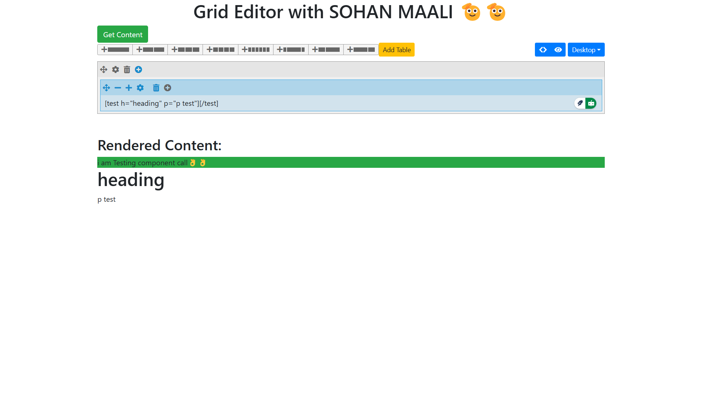

# Grid Editor with SOHAN MAALI



## 📌 Overview
Grid Editor is a web-based tool that allows users to create, edit, and manage content using a grid-based structure. It includes features like dynamic content rendering, table insertion, and real-time component updates.

## 🚀 Features
- **Dynamic Grid System**: Add, edit, and manage grid components with ease.
- **Live Content Rendering**: Instantly view changes in the rendered output.
- **Table Support**: Insert tables with custom configurations.
- **Component-Based Parsing**: Uses shortcodes for structured content representation.
- **Interactive UI**: Includes buttons, dropdowns, and customizable options.

## 🛠️ Technologies Used
- **Frontend**: React.js, BootStrap

## 📂 Project Structure
```
/grid-editor
│── public/
│── src/
│   │── Helper/
|   |   |── PageRender.js
│   │── components/
│   │   │── Test.js
│   │   │── Inner.js
│   │── js/
|   |   |──jquery.grideditor.js
|   |   |──jquery.grideditor5.js
│   │── App.js
│   │── GridEditor.js
│── package.json
│── README.md
```

## 💻 Installation & Setup
1. **Clone the Repository**
   ```sh
   git clone https://github.com/sohanmaali/My-Grid-Editor.git
   cd grid-editor
   ```
2. **Install Dependencies**
   ```sh
   npm install
   ```
3. **Run the Application**
   ```sh
   npm start
   ```

## 📜 Usage
- Click on **'Add Table'** to insert a table.
- Use the **grid controls** to manage layout.
- Click **'Get Content'** to retrieve and render structured content.

## 📷 Screenshot


## 📌 Future Improvements
- **Drag-and-Drop Support**
- **Export to JSON/HTML**
- **User Authentication for Content Management**

## 📞 Contact
For questions or contributions, reach out to **Sohan Maali** via GitHub or email.

---
**Enjoy Coding! 🚀**

